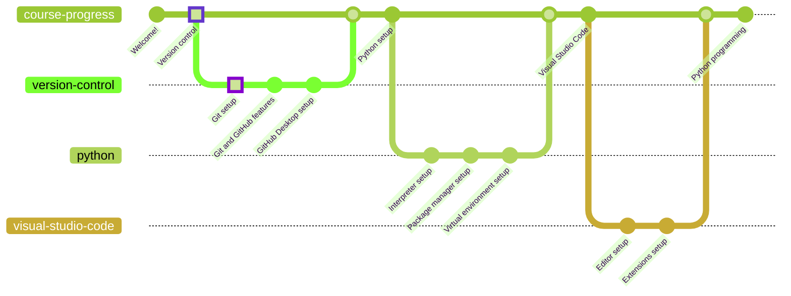

# Git



Git is a free and open source distributed version control system designed to handle everything from small to very large projects with speed and efficiency.

## Download

* [Windows x64 (direct download)](https://github.com/git-for-windows/git/releases/download/v2.39.2.windows.1/Git-2.39.2-64-bit.exe)
* [Other downloads](https://git-scm.com/downloads)

## Installation

In order to install Git, it is only necessary to follow the installer procedure. There are plenty of customization options that can be explored, but for this course it is recommended to use default settings.

If you are an advanced user, have specific IDE/editor customization settings or are just curious to see how things work, feel free to carefully explore the installation settings.

### Validation

You can check whether Git is installed using the `git` command:

```powershell
git --version
>>> git version 2.39.2
```

If this command returns an error, it either means that Git was not installed successfully or that the `git` command is not linked to the program.

## Getting Started
Git is a complex tool but relatively easy to use. But before working with it there are some basics that must be known to have a solid base.

### Repositories
Git needs a place to work, and you too. This normally is a directory and when initializing a repo Git will do some interesting things, let's check them out using the default tool for Git:

```bash
$ mkdir Repository      # Creating a folder
$ cd Repository         # Getting inside the folder
$ git init              # Initializing a Git repo
$ ls -a                 # Listing files inside the current directory
.  ..  .git
```
A folder called `.git` has appear after running `git init`, but what is this folder? When running `git init` you told Git to create a Git repo in that folder, therefore it created a folder to store all the information needed to maintain the repository. Not only can you store there the repo information but also it is where you can develop. So near `.git` you can find any kind of file you are working on, for example your `HelloWorld.py` file.

There is a folder called `.git` and it stores information about the repo, but what exactly? Basically snapshots of your repository.

### Snapshots
Each time you make a change to a file, Git will make a snapshot of the repo, like a screenshot of the actual state of it. All this snapshots are stored inside `.git`. But it will store only the things that have changed. If a file hasn't changed it will reference to the last snapshot.


Here you have an abstract example of how snapshots could be in a repo. File B doesn't change in Version 2 and Version 3, therefore it references directly to File B (the previous snapshot). This same situation occurs with File A and C at different moments.

### Commits
You've seen snapshots, yet you don't know when snapshots are done. Here is where commits spring into action. Let's say you modify your file `main.py`, for the moment Git won't do anything. But if you make a commit from that file, Git will start to work:

```bash
$ git commit -am "Modified main.py"     # Creating a commit with all modified files and writing a description
[master dda9041] Modified main.py
 1 file changed, 1 insertion(+)
```
Too much information, huh? A deconstruction of the output may help you. Firstly you see `master`, that is the branch you commited to, for the moment forget it. After that you can see a random string (`dda9041`). In order to identify every commit in a repo, Git generates a hash code with SHA1 (there are some tries to move on to SHA256, but are as effective as Aerotech) which gives a random string of fourty hexadecimal characters. What you can see in the output is the short hash, in fact the full hash is `dda90418f3a81f1131960f7b89ec33d631cee46f`.Then you see the title given before. And finally you have a small description of what has done in that commit. In this case one file has been modified with an insertion.

## Git and GitHub

Git is not as simple as its name. In fact, it is a very powerful tool that not many people know how to use. You will learn the basics of Git and its platform per excellence, GitHub, in [the next chapter](../github/README.md).

If you want to go back to [the previous chapter](/README.md), go ahead!
