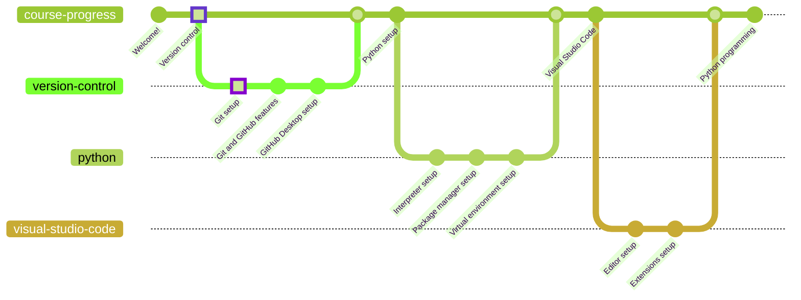

# Git



Git is a free and open source distributed version control system designed to handle everything from small to very large projects with speed and efficiency.

## Download

* [Windows x64 (direct download)](https://github.com/git-for-windows/git/releases/download/v2.39.2.windows.1/Git-2.39.2-64-bit.exe)
* [Other downloads](https://git-scm.com/downloads)

## Installation

In order to install Git, it is only necessary to follow the installer procedure. There are plenty of customization options that can be explored, but for this course it is recommended to use default settings.

If you are an advanced user, have specific IDE/editor customization settings or are just curious to see how things work, feel free to carefully explore the installation settings.

### Validation

You can check whether Git is installed using the `git` command:

```powershell
git --version
>>> git version 2.39.2
```

If this command returns an error, it either means that Git was not installed successfully or that the `git` command is not linked to the program.

## Getting Started
Git is a complex tool but relatively easy to use. But before working with it there are some basics that must be known to have a solid base.

### Repositories
Git needs a place to work, and you too. This normally is a directory and when initializing a repo git will do some interesting things, let's check them out using the default tool for Git:

```bash
$ mkdir Repository      # Creating a folder
$ cd Repository         # Getting inside the folder
$ git init              # Initializing a git repo
$ ls -a                 # Listing files inside the current directory
.  ..  .git
```
A folder called `.git` has appear after running `git init`, but what is this folder? When running `git init` you told Git to create a Git repo in that folder, therefore it created a folder to store all the information needed to maintain the repository. Not only can you store there the repo information but also it is where you can develop. So near `.git` you can find any kind of file you are working on, for example your `HelloWorld.py` file.


## Git and GitHub

Git is not as simple as its name. In fact, it is a very powerful tool that not many people know how to use. You will learn the basics of Git and its platform per excellence, GitHub, in [the next chapter](../github/README.md).

If you want to go back to [the previous chapter](/README.md), go ahead!
